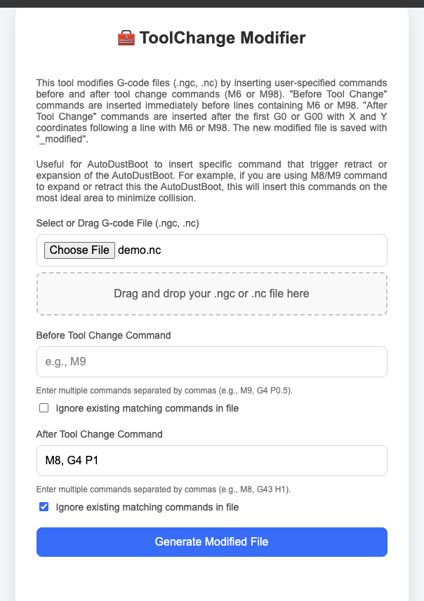

# ToolChange Modifier

A lightweight tool that modifies G-code files by inserting custom commands before or after each ToolChange command like `M6` or `M98`. Useful for smarter way to retract/expand AutoDustBoot. Just open the file utility/tschanger.html on Chrome browser.

---

## 🚀 Features

- Automatically inserts custom g-code command before and after the toolchange
- Supports multiple insert commands, comma-separated (e.g. `M8,G4 P1`)


## 🧪 Examples

Sample NC (demo.nc) file content.

```
...
N210 (Toolpath:- V-Carve 1 [Clear 1])
N220 ()
N230 (Change to tool End Mill {1/4"} UP CUT)
N240 M98 P631
N250 S19000 M03
N280 G00 X8.449 Y-0.896
N290 G00
N300 G00 X8.449 Y-0.896
N310 G00 Z3.810
N320 G00 X8.449 Y-0.896
N330 G00 Z2.540
...
```




This will generate a new NC  (demo_modified.nc) file with the following changes:

```
...
N210 (Toolpath:- V-Carve 1 [Clear 1])
N220 ()
N230 (Change to tool End Mill {1/4"} UP CUT)
N240 M98 P631
N250 S19000 M03
N280 G00 X8.449 Y-0.896
M8 👈
G4 P1 👈
N290 G00
N300 G00 X8.449 Y-0.896
N310 G00 Z3.810
N320 G00 X8.449 Y-0.896
N330 G00 Z2.540
...
```


## ✍️ Author

Developed by FrancisCreation

Pull requests and contributions welcome!


